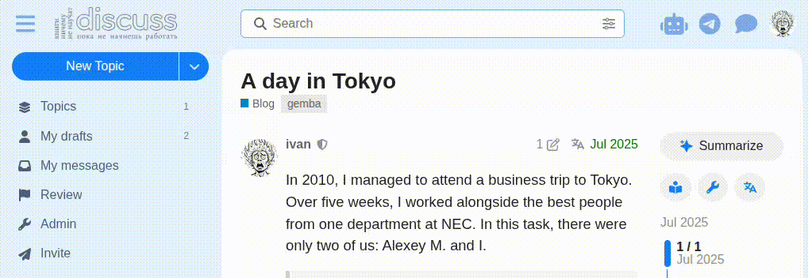

# AI Summary In Topic Header

Discourse **theme component**: adds a **discourse-ai** topic summarize button to the **topic sidebar** (timeline controls or Table of Contents) on desktop, and to the **topic title area** on mobile and narrow screens.

## Requirements

- [discourse-ai](https://github.com/discourse/discourse-ai) with topic summarization enabled for your users.

## Compatibility

- **[DiscoTOC](https://github.com/discourse/DiscoTOC)** — when active, the button appears in the ToC instead of the timeline (no duplicates).
- **[Reader Mode](https://github.com/discourse/reader-mode)** — optional `Keep in reader mode` setting keeps the button visible.

## Install

1. Admin → **Customize** → **Themes** → install this component (Git URL or upload).
2. Enable the component on your active theme(s).

## Settings

| Setting                 | Default | Description                                                                                                                                                       |
| ----------------------- | ------- | ----------------------------------------------------------------------------------------------------------------------------------------------------------------- |
| **Show in timeline**    | On      | Show the summarize button in the sidebar (timeline or ToC). On narrow desktop screens where the sidebar is hidden, the button falls back to the topic title area. |
| **Show on mobile**      | On      | Show the summarize button in the topic title area on mobile devices.                                                                                              |
| **Keep in reader mode** | Off     | Keep the button visible when [Reader Mode](https://github.com/discourse/reader-mode) is active.                                                                   |

## How it works

The button placement adapts to the available layout:

1. **Desktop (wide)** — sidebar is visible → button in **ToC** (if [DiscoTOC](https://github.com/discourse/DiscoTOC) present) or **timeline controls**.
2. **Desktop (narrow)** — sidebar hidden by Discourse → button in the **topic title area** (below the title and category/tags).
3. **Mobile** — button in the **topic title area**.

When the browser window is resized, the button automatically moves to the correct location (stale buttons from previous layouts are cleaned up).

## License

MIT — see [LICENSE.txt](LICENSE.txt).
