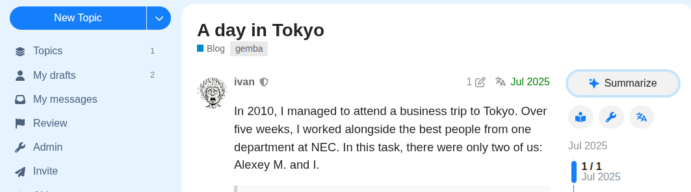

# AI Summary in topic header

Discourse **theme component**: moves the **discourse-ai** topic summarize button from the topic map into the topic title area (`#topic-title`), next to the heading.

## Requirements

- [discourse-ai](https://github.com/discourse/discourse-ai) with topic summarization enabled for your users.

## Install

1. Admin → **Customize** → **Themes** → install this component (Git URL or upload).
2. Enable the component on your active theme(s).

## License

MIT — see [LICENSE.txt](LICENSE.txt).
